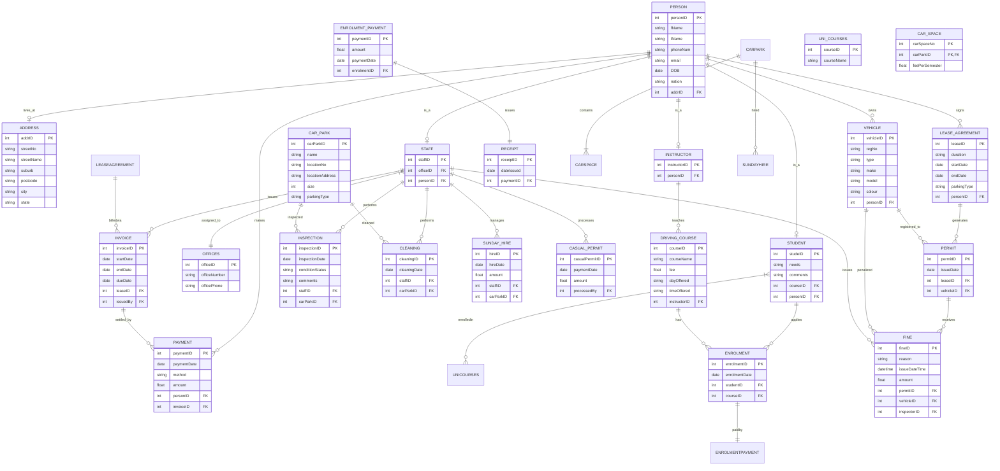

```mermaid
erDiagram
    PERSON ||--o| ADDRESS : lives_at
    PERSON ||--o{ VEHICLE : owns
    PERSON ||--o{ LEASE_AGREEMENT : signs
    PERSON ||--o{ PAYMENT : makes
    PERSON ||--o| STUDENT : is_a
    PERSON ||--o| STAFF : is_a
    PERSON ||--o| INSTRUCTOR : is_a

    STUDENT }|--o{ UNICOURSES : enrolledin
    STUDENT ||--o{ ENROLMENT : applies
    STAFF }|--|| OFFICES : assigned_to
    STAFF ||--o{ INVOICE : issues
    STAFF ||--o{ INSPECTION : performs
    STAFF ||--o{ CLEANING : performs
    STAFF ||--o{ SUNDAY_HIRE : manages
    STAFF ||--o{ CASUAL_PERMIT : processes

    INSTRUCTOR ||--o{ DRIVING_COURSE : teaches
    DRIVING_COURSE ||--o{ ENROLMENT : has
    ENROLMENT ||--|| ENROLMENTPAYMENT : paidby
    ENROLMENT_PAYMENT ||--|| RECEIPT : issues

    CARPARK ||--|{ CARSPACE : contains
    CAR_PARK ||--o{ INSPECTION : inspected
    CAR_PARK ||--o{ CLEANING : cleaned
    CARPARK ||--o{ SUNDAYHIRE : hired

    LEASE_AGREEMENT ||--o{ PERMIT : generates
    LEASEAGREEMENT ||--o{ INVOICE : billedvia
    PERMIT ||--o{ FINE : receives
    VEHICLE ||--o{ PERMIT : registered_to
    VEHICLE ||--o{ FINE : penalized
    INVOICE ||--o{ PAYMENT : settled_by
    STAFF ||--o{ FINE : issues

    PERSON {
        int personID PK
        string fName
        string lName
        string phoneNum
        string email
        date DOB
        string nation
        int addrID FK
    }
    ADDRESS {
        int addrID PK
        string streetNo
        string streetName
        string suburb
        string postcode
        string city
        string state
    }
    VEHICLE {
        int vehicleID PK
        string regNo
        string type
        string make
        string model
        string colour
        int personID FK
    }
    STUDENT {
        int studeID PK
        string needs
        string comments
        int courseID FK
        int personID FK
    }
    STAFF {
        int staffID PK
        int officeID FK
        int personID FK
    }
    INSTRUCTOR {
        int instructorID PK
        int personID FK
    }
    OFFICES {
        int officeID PK
        string officeNumber
        string officePhone
    }
    UNI_COURSES {
        int courseID PK
        string courseName
    }
    CAR_PARK {
        int carParkID PK
        string name
        string locationNo
        string locationAddress
        int size
        string parkingType
    }
    CAR_SPACE {
        int carSpaceNo PK
        int carParkID PK, FK
        float feePerSemester
    }
    LEASE_AGREEMENT {
        int leaseID PK
        string duration
        date startDate
        date endDate
        string parkingType
        int personID FK
    }
    PERMIT {
        int permitID PK
        date issueDate
        int leaseID FK
        int vehicleID FK
    }
    INVOICE {
        int invoiceID PK
        date startDate
        date endDate
        date dueDate
        int leaseID FK
        int issuedBy FK
    }
    PAYMENT {
        int paymentID PK
        date paymentDate
        string method
        float amount
        int personID FK
        int invoiceID FK
    }
    FINE {
        int fineID PK
        string reason
        datetime issueDateTime
        float amount
        int permitID FK
        int vehicleID FK
        int inspectorID FK
    }
    INSPECTION {
        int inspectionID PK
        date inspectionDate
        string conditionStatus
        string comments
        int staffID FK
        int carParkID FK
    }
    CLEANING {
        int cleaningID PK
        date cleaningDate
        int staffID FK
        int carParkID FK
    }
    SUNDAY_HIRE {
        int hireID PK
        date hireDate
        float amount
        int staffID FK
        int carParkID FK
    }
    DRIVING_COURSE {
        int courseID PK
        string courseName
        float fee
        string dayOffered
        string timeOffered
        int instructorID FK
    }
    ENROLMENT {
        int enrolmentID PK
        date enrolmentDate
        int studentID FK
        int courseID FK
    }
    ENROLMENT_PAYMENT {
        int paymentID PK
        float amount
        date paymentDate
        int enrolmentID FK
    }
    RECEIPT {
        int receiptID PK
        date dateIssued
        int paymentID FK
    }
    CASUAL_PERMIT {
        int casualPermitID PK
        date paymentDate
        float amount
        int processedBy FK
    }
```

